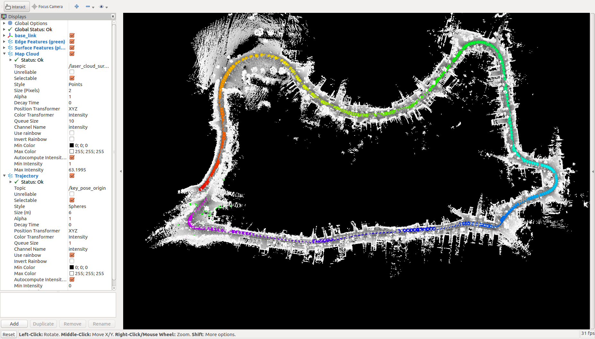
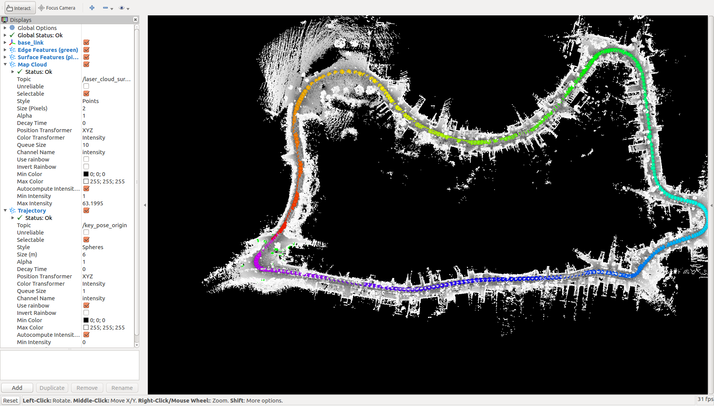
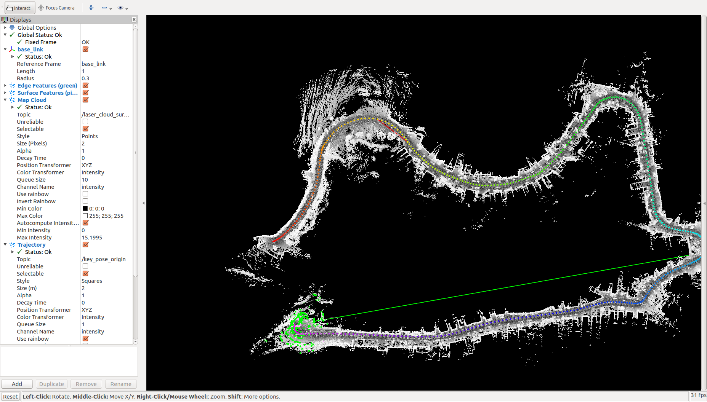
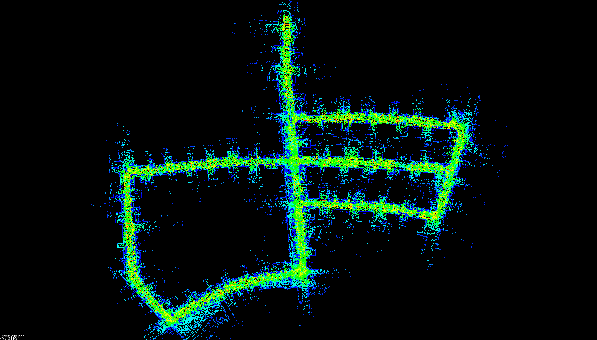
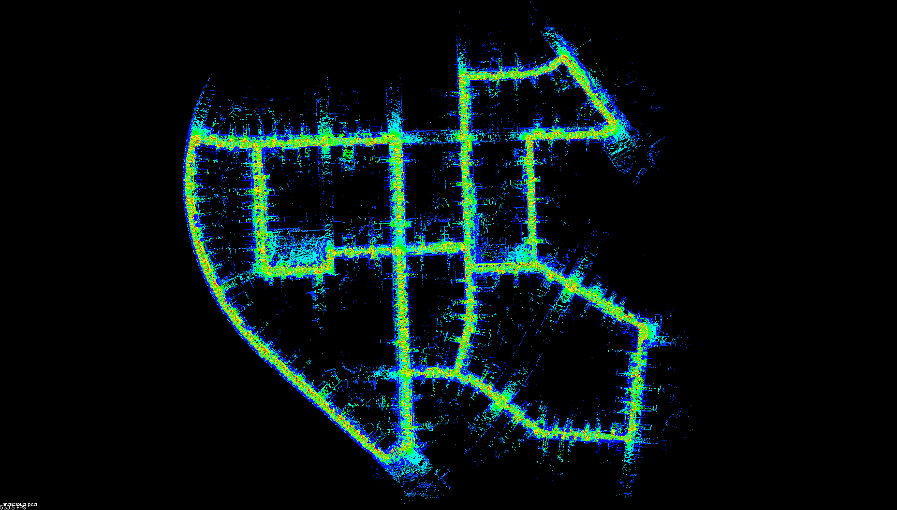
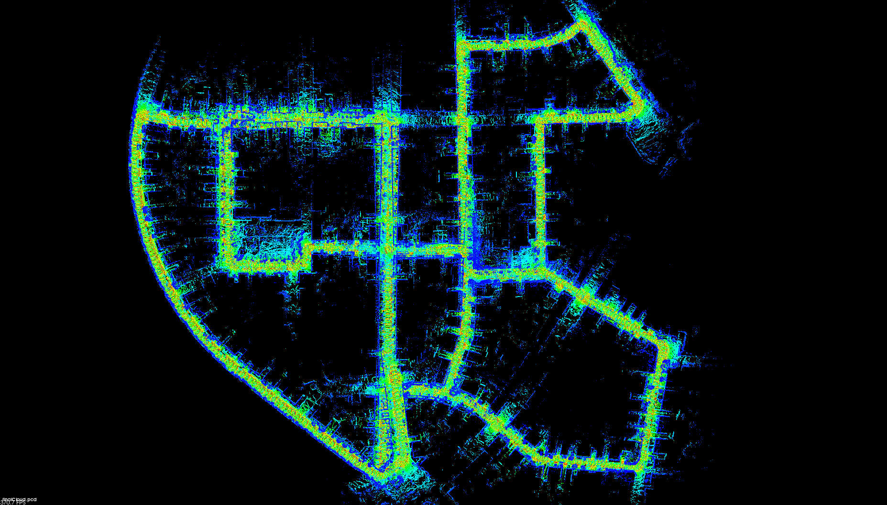
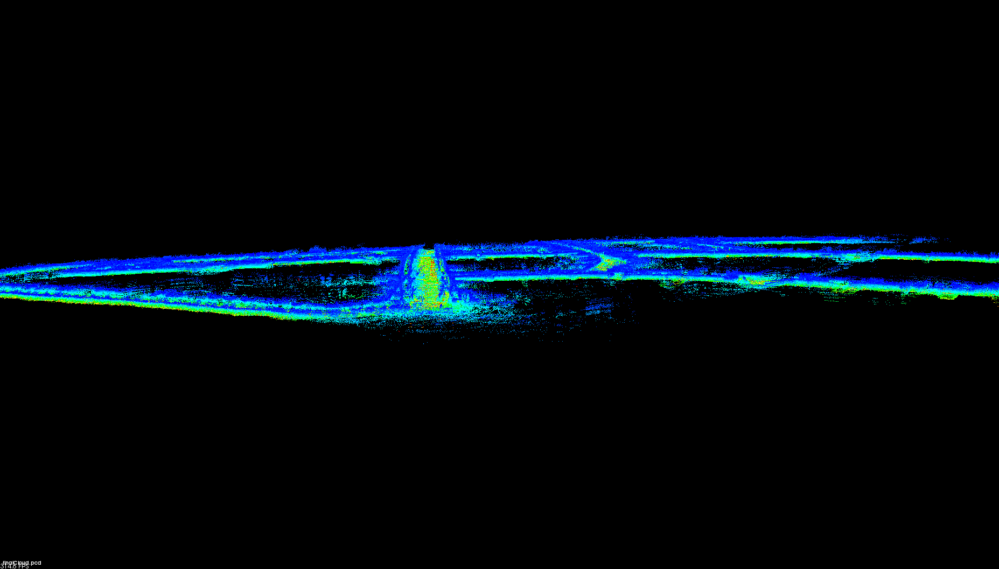
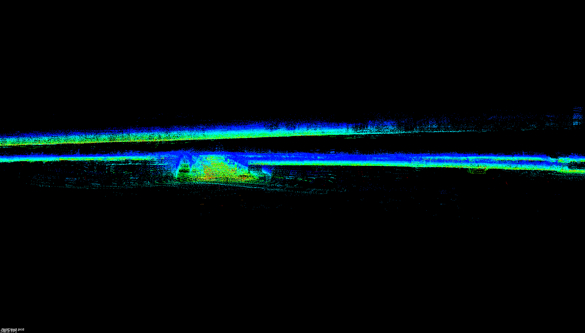
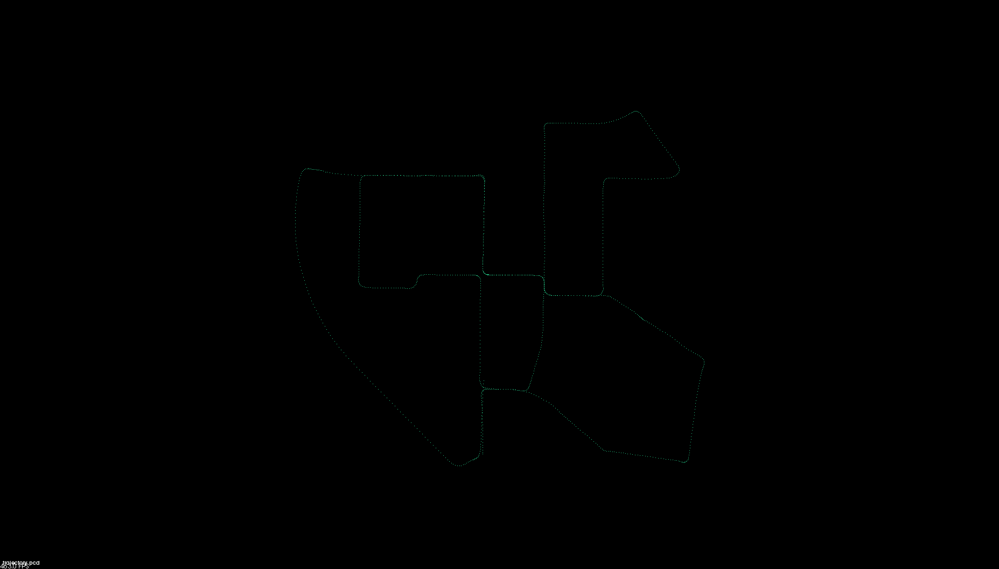
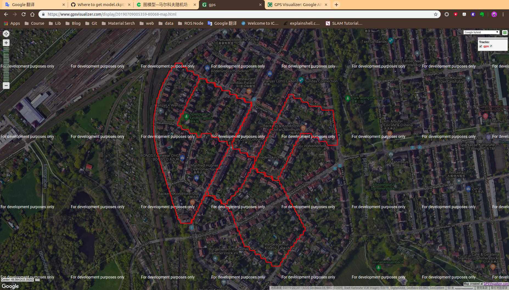

# L-Loam

## An Example
> test kitti sequence 09
> 
__without loop closing__

__with loop closing__

## Add visualization_msgs::Marker
> Display the loop closure,  green for wrong, red for true.

## save map and trajectory
> test kitti sequence 05

## Update loop detection strategy and save map without downsample

## More example 

#### map from topdown

#### map from side

#### trajectory

## save corner_map & surf_map
## save gps 
https://www.gpsvisualizer.com/
